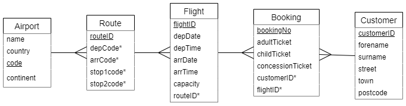

# N5 DDD Flights

## Introduction

Loganair has decided to expand where it flies to.  To save on costs it will work with another small airline that already has a booking system that it can make use of.

The design of the database is shown below.



Every airport has a 3-letter code to identify it, i.e. `BRR` is the code for Barra , and `LHR` is the code for London Heathrow.

The database contains a number of routes.  Every route holds the airport code for the depature airport (`depCode`) and the code for the arrival airport (`arrCode`).

Some routes stop at other airports on the way.  If there are any stops, then `mid1code`, and possibly `mid2code` will contain airport codes.

If there are no stops, then `mid1code` and `mid2code` will hold a special value of `NULL` to show that they are empty.

Loganair will use `routeID`s starting from 8000.

## Tasks

___1___ Using the Airport table, display all the details for Glasgow airport (GLA).

___2___ Using the Route table, display all the details for routes that depart from Glasgow.

___3___ Display all the details for airports that planes from Glasgow fly to or stop at.

___4___ Due to an oversight, the Barra airport has not been included in the Airport table; even though it has more runways than Heathrow!

Add Barra (BRR) to the airport table using the the following details:

``` sql
"Barra", "United Kingdom", "BRR", "Europe"
```

___5___ Display all the information that was just added.

___6___ The Barra (BRR) to Glasgow (GLA) route is not in the database.  There are no stops in between.  Add the following values to the ROute table:

``` sql
8000, "BRR", "GLA", NULL, NULL
```

___7___ Add the return journey so that people can get home.  Use the next number for the `routeID`.

___8___ Display all the information that was added for the two routes.

___9___ Loganair wants to expand its reach in the UK.  Add a route that flies from Barra to Bristol with stops at Glasgow and then Birmingham.

___10___ Add the return route.

___11___ Display all the information that was added for the two routes.

___12___ Loganair is thinking about adding routes that go to Denmark.  Display the following information for all airports in Denmark.

| name | code |
| ---- | ---- |
|      |      |

___13___ Add a route for the 'Lego Express' that will depart Barra for Billund in Denmark, going via Glasgow.

___14___ Add the return journey.

___15___ Display all the information that was added for the two routes.

___16___ Add a Barra to Glasgow flight to the Flight table using the following details:

```
flightID: LM0456
depDate: 2024-02-02
depTime: 14:55:00
arrDate: 2024-02-02
arrTime: 16:05:00
capacity: 18
routeID: 8000
```

___17___ Add the return flight, LM0451, on 4<sup>th</sup> Feb 2024.  It will depart Galsgow at 1015 am, and land at 1130 am, and has the same number of seats.

___18___ Display all the information that was added for the two flights.  Display the flights with the earliest flight first.
