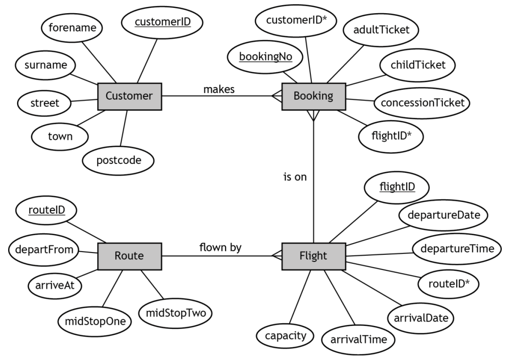
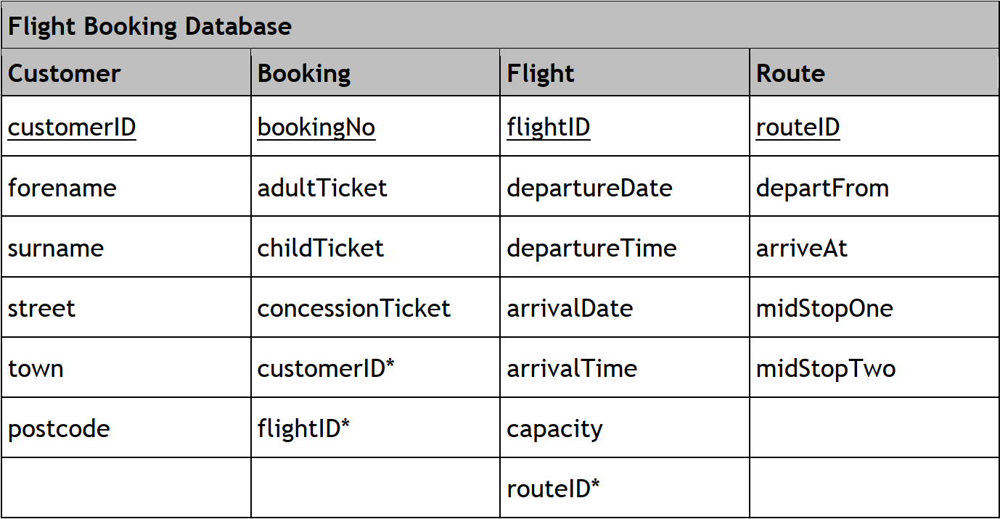

# H CS 2019 Task 1 Part B

### Database design and development

Following further analysis the entity-relationship diagram below is created.

This design is then implemented.

___1b(i)___ John Smith, Customer ID - GR01932, has asked for a copy of the tax he has paid on flight QH182. The tax for a booking is calculated as follows:

* adults pay £5.50 
* children pay £2.00 
* concessions pay £1.50 

Implement the SQL statement that will produce an output with the headings.

| forename | surname | Tax (£) |
| --- | --- | --- |
|  |   |     |

Print evidence of the implemented SQL statement and the output it produced. (__3 marks__) 

___1b(ii)___ The airline wishes to identify the customer(s) who made a booking with the greatest number of children.

Implement two SQL statements that will find the forename and surname of the customer(s) who made a booking with the greatest number of children. 

| forename | surname |
| --- | --- |
|  |   |

Print evidence of the implemented SQL statements and the output produced. (__4 marks__)

## Extension Questions

* For each of the following questions write and test the SQL required to create the described output.

* The questions involve calculations, wildcards and aggregate functions (AVG, SUM, MIN, MAX, and COUNT).

* Make sure you create aliases where appropriate.

### Questions

___1c___ Display the total number of adult tickets, purchased by passengers living in postcode area EH. (__4 marks__) 

___1d___ Display the total number of passengers whose flights departed in April 2018. (__5 marks__)

___1e___ Display the average capacity of all the flights that departed from any airport with a code ending with “N”.  (__4 marks__)

___1f___ Display the number of customer bookings by town.

This should be limited to flights that arrived at London Heathrow (LHR) in 2018.  (__6 marks__)

___1g___ Customer Grant Reid has purchased an extra travel bag for every adult and child costing £15 each.

Display the total amount this customer has spent on bags.  (__5 marks__)

___1h___ Flight A131T531Y47 charged the following for ticket fares: adult £55, child £40, concession £30.

Calculate and display each customer’s name and the total fares paid by each customer on this flight.  (__6 marks__)

___1i___ Airport tax is charged at £7.50 for an adult and £5.00 for a child.

Display the forename and surname of passengers along with the difference between the total airport tax of the adult tickets purchased and the total airport tax of the child tickets purchased.

The output should be limited to flights that had one stop at AMS (Amsterdam) between the departure airport and the arrival airport.  (__6 marks__)
